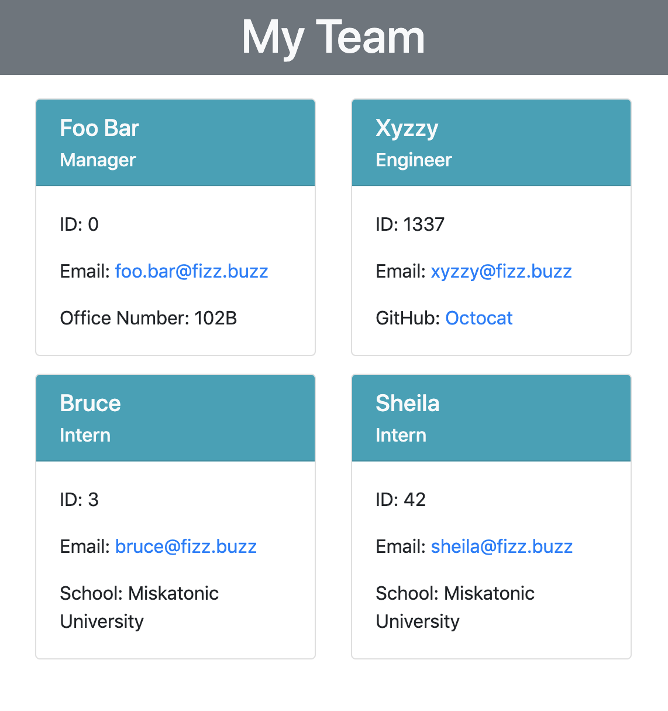
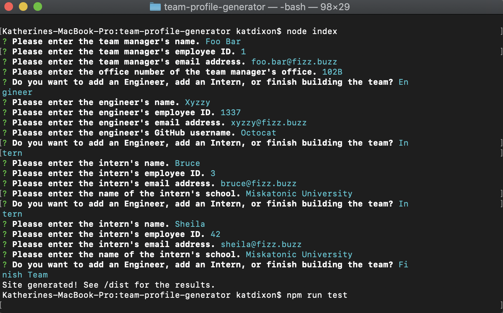

# Team Profile Generator

A node.js program for generating a simple team profile website in the command line

## Features

- Simple command line interface using [Inquirer.js](https://www.npmjs.com/package/inquirer)
- Creates a simple site with responsive design using [Bootstrap](https://getbootstrap.com/)
- Included tests using [Jest](https://jestjs.io/)

## Installation

Clone the repository, then run `npm i` to install dependencies.

## How to Use

Enter `node index` in the command line and then answer the prompts. See the attached video for more: 

https://drive.google.com/file/d/1iIc7m1NKzJsneV9PihvsU5vPX1xO9dY2/view

## Tests

Run `npm run test`.

## About the Programmer

Kat Dixon is a developing developer with interests in accessibility, security, and the intersections between the two.